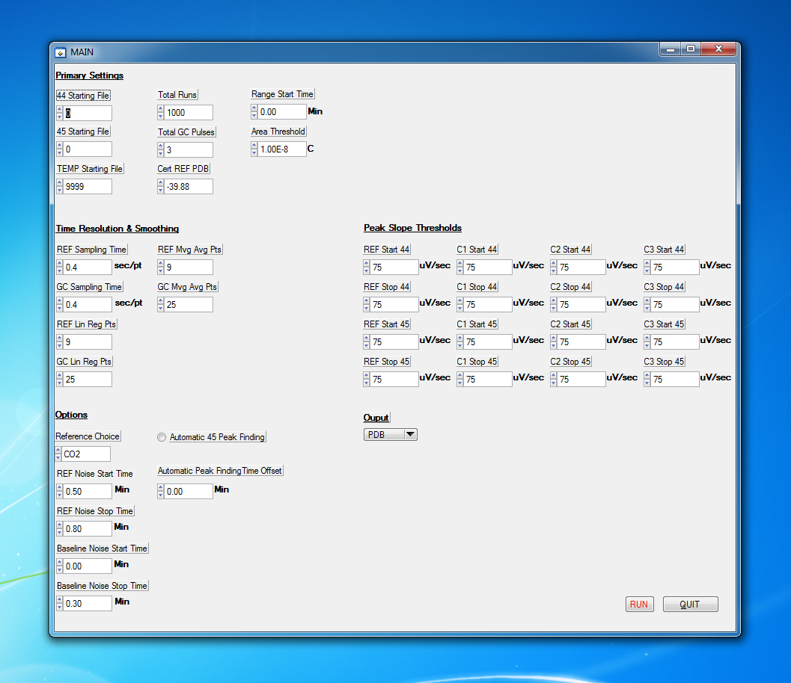
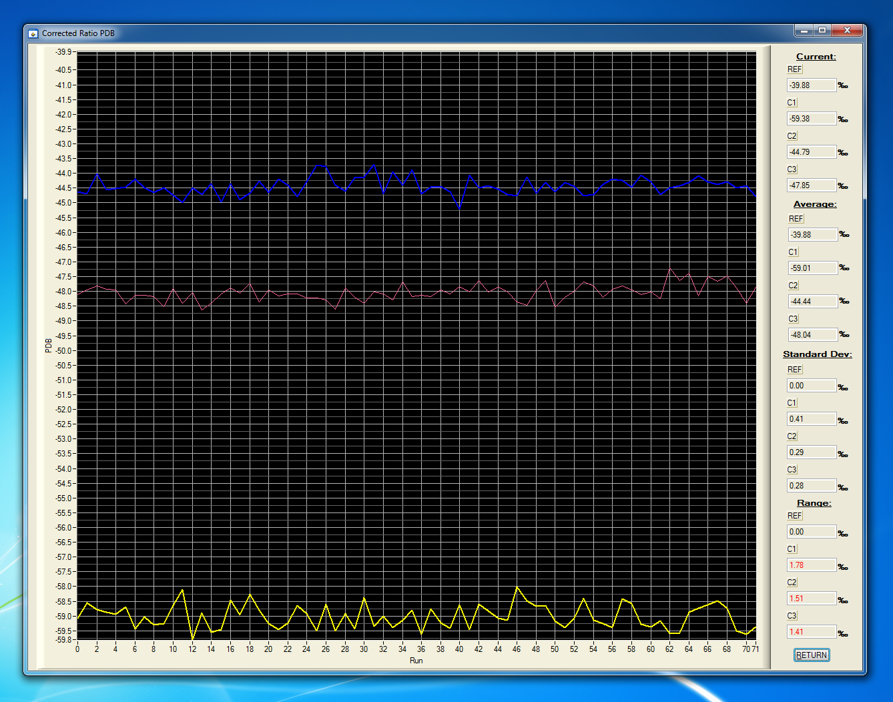

# GC-C-IRMS_Data_Processor

This software was developed in conjunction with a GC-C-IRMS instrument designed to measure the carbon isotope ratio of the methane, ethane, and propane present in a gas sample.  A GC-C-IRMS consists of three distinct modules: a Gas Chromatograph (GC), a Combustion Oven (C), and an Isotope Ratio Mass Spectrometer (IRMS). The GC module first accepts the sample and separates the three hydrocarbon components of interest. As the components exit the GC, they are then directed to the second module, a Combustion Oven maintained at a high temperature and supplied with auxiliary oxygen. This results in oxidation of the hydrocarbons to water and carbon dioxide. The water is removed, while the carbon dioxide is finally sent to the mass spectrometer, which directly measures the carbon isotope ratio of the carbon dioxide, and thus, indirectly measures that of the three hydrocarbons.

In terms of process design, the mass spectrometer was treated like a standard GC detector, and the GC Manufacturer's software ([SRI PeakSimple](http://www.srigc.com/pages/software_downloads/)) was used to collect the raw data and display the chromatograph in real-time.  A custom software package then directed PeakSimple's operation and collected results from the output files generated.  In chromatography, the usual desired measurement is generated by calculating the area under a curve, and a lot of literature has been produced concerning the best methods for going about this task, usually referred to as Peak Finding.  Unfortunately, PeakSimple lacked sophistication in this regard, offering merely two parameters whose precise effect was also never fully described.  Moreover, the issue was exacerbated by the fact that the extreme precision desired for the instrument required the use of a square-like reference pulse in conjunction with the normal gaussian-shaped GC peaks.  Precisely determining the area under curves of such sharply contrasting shapes requires different sets of optimal parameters.  Finally, while PeakSimple generated output files containing the raw data in addition to it's calculated results, and a user could load the raw data and see how modifications to integration parameters affected one analysis, there was no way for a user to see how modifications affected large sets of multiple analyses.  This software was created to overcome these limitations.  It allows the user to process entire sets of raw .asc files produced by PeakSimple in a thoroughly customizable way. 

In performing multiple analyses of the same gas sample, use of this software over PeakSimple alone consistently reduced the standard deviation of measurements by half.  After some additional refinement, this standalone version was eventually incorporated into a single custom software package which controlled and interacted with PeakSimple and the instrument for full front-end operational control and data processing.  In this version, after processing a set, the value of interest is graphed, and a comma delimited output file is generated containing the full results.  This software was written in C using LabWindows, and use of the included binary requires installation of the [2013 LabWindows Run-Time Engine.](http://www.ni.com/download/labwindowscvi-run-time-engine-2013-sp2/4810/en/)

Created by Blake Leonard.

blake@leonardlabs.net